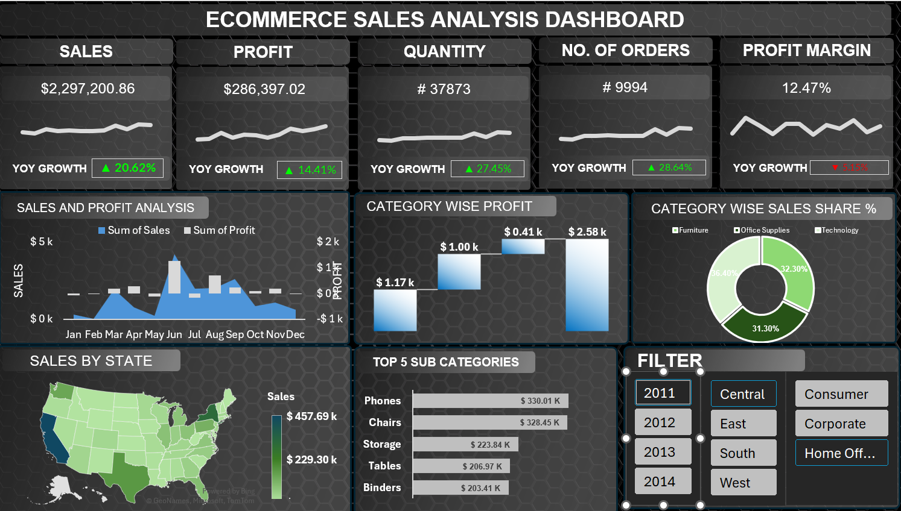

# 📊 E-Commerce Sales Analysis Dashboard

## 🚀 Project Overview

This project is an interactive **E-Commerce Sales Analysis Dashboard** built entirely in **Microsoft Excel**. The dashboard transforms raw sales data into meaningful business insights through KPI tracking, interactive filtering, and dynamic visualizations.

It helps analyze sales performance, profitability, customer segments, product categories, and regional trends, enabling data-driven decision-making.

---

## 🎯 Business Objective

The objective of this dashboard is to monitor key business metrics, identify growth opportunities, and provide actionable insights for improving overall sales performance.

---

## 📈 Dashboard Features

### Sales & Profit Analysis

* Monthly sales and profit trend analysis.
* Performance comparison across the year.

### Category Wise Profit Analysis

* Identify the most profitable product categories.

### Category Wise Sales Share

* Analyze category contribution to overall sales.

### Sales by State

* Geographic visualization of sales performance across the United States.

### Top 5 Sub-Categories

* Identify best-selling product sub-categories.

### Interactive Filters

* Year Filter
* Region Filter
* Customer Segment Filter

---

## 🛠 Tools & Technologies Used

* Microsoft Excel
* Pivot Tables
* Pivot Charts
* Slicers
* KPI Cards
* Conditional Formatting
* Data Cleaning
* Data Visualization
* Dashboard Design

---

## 📷 Dashboard Preview

---

## 📚 Skills Demonstrated

* Data Analysis
* Business Intelligence
* Dashboard Development
* KPI Reporting
* Data Visualization
* Sales Analytics
* Excel Automation

---

## 👨‍💻 Author

**Abhishek Sharma**

MCA Student | Aspiring Data Analyst

### Connect With Me

* GitHub: https://github.com/abhishek06092003
* LinkedIn: https://linkedin.com/in/abhishek-sharma-5b0498356

---

⭐ If you found this project useful, feel free to star the repository and connect with me.

